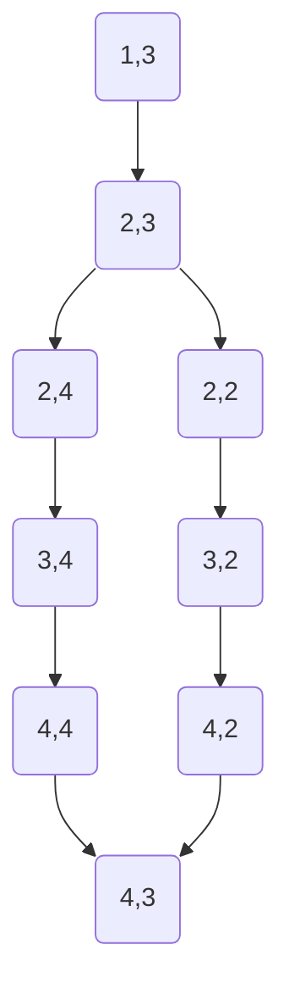

# Promenons-nous dans les bois


> *Promenons-nous dans les bois,*  
> *Pendant que le loup n'y est pas.*  
> *Si le loup y était*  
> *Il nous mangerait,*  
> *Mais comme il y est pas,*  
> *Il nous mangera pas.*  
> *Loup, y es-tu ?*  
> *Que fais-tu ?*  
> *M'entends-tu ?*
---

### Contexte

Il s'agit de simuler un (ou des enfants) qui cartographie une forêt en chantant la comptine *"Promenons-nous dans les
bois"*.

- À chaque phrase prononcée par l'enfant, il a le droit d'avancer dans la forêt (déplacement possible sur les 8 cases
  adjacentes).
- Au bout d'un moment (dépendant du nombre de vêtements que le loup enfilera avant de sortir, ce nombre est
  naturellement aléatoire), le loup sort de sa cachette et révèle sa position.
- À partir de ce moment, il se déplace dans la forêt à la recherche des enfants.  
  Le loup n'est pas bloqué par les arbres et peut se déplacer sur toute la carte.
- L'enfant doit retourner à sa position de départ (ou autre, à vous de décider) avant de se faire manger.
- S'il ne s'est pas fait manger, il peut retourner dans la forêt et poursuivre sa cartographie.
- La forêt est représentée par un fichier `.txt`.  
  Les `'1'` sont des arbres (infranchissables par l'enfant) et les espaces `' '` des chemins praticables.

---

### Fichiers fournis

- Le code de départ contenant :
    - le déroulement de la comptine
    - la gestion du loup
- Les fichiers :
    - `comptine.txt`
    - `vetements.txt`
    - `foret1.txt` à `foret5.txt`

---

### Travail demandé

- Un fichier au format **Mermaid (.mmd)** représentant les chemins découverts par l'enfant.

```
%% Exemple de graphe généré pour la forêt ci-dessous :
%% 11 11
%% 1   1
%% 1 1 1
%% 1   1
%% 11111

graph TD
    1(1,3) --> 2(2,3)
    2 --> 3(2,4)
    3 --> 4(3,4)
    4 --> 5(4,4)
    2 --> 6(2,2)
    6 --> 7(3,2)
    7 --> 8(4,2)
    5 --> 9(4,3)
    8 --> 9
```   



### Notre approche :
On a commencé par découper un peu plus le projet en plusieurs fichiers pour s'y retrouver plus facilement. 
Un fichier pour l'enfant, un pour le loup, un pour la forêt, mais aussi un pour les coordonnées, pour le jeu en lui-même ou pour la carte. 
L'idée c'était de pouvoir modifier une partie sans tout casser et de pouvoir tester plus facilement chaque partie indépendamment.
Pour la cartographie, on a utilisé un graphe avec des listes chaînées. Ainsi chaque position visitée devient un sommet, et chaque déplacement crée une arête. 
On évite les doublons en vérifiant si la position existe déjà avant d'en créer une nouvelle. Et à la fin, on exporte tout ça en Mermaid pour avoir un rendu visuel des chemins.
On a aussi ajouté une carte de trajet en parallèle. C'est juste une grille de la même taille que la forêt où on marque les cases visitées avec des 1. 
Ça permet de voir rapidement où l'enfant est passé, c'est plus parlant qu'un graphe visuellement.

### Les galères qu'on a eues :

-Le loup qui partait en vadrouille :
Au début, le loup pouvait sortir complètement de la forêt et avoir des coordonnées négatives. 
Pas très logique. 
On a ajouté des vérifications à chaque déplacement pour le garder dans les limites de la carte.

-L'enfant qui spawnait au milieu de nulle part :
L'enfant apparaissait toujours au centre de la forêt. 
On voulait qu'il commence sur un bord aléatoire. 
On a fait une fonction qui scanne tous les bords, récupère les positions sans arbre, et en choisit une au hasard.

-La partie qui finissait direct :
Gros bug : l'enfant spawnait sur un bord, bougeait d'une case vers un autre bord, et hop victoire instantanée. 
Pas terrible pour un jeu d'exploration...
On a réglé ça en faisant en sorte que la victoire ne puisse arriver que si le loup était bien sorti. 

-On ne voyait rien du trajet :
Le graphe Mermaid c'est bien, mais c'est pas évident à lire. 
On a ajouté la carte de trajet qui génère un fichier texte simple : des 1 là où l'enfant est passé, des espaces ailleurs. 
C'est beaucoup plus clair pour visualiser le parcours.

-La mémoire qui fuit :
Avec tous les sommets et arêtes qu'on crée dynamiquement, on risquait des fuites mémoire. 
On a fait attention à bien tout libérer à la fin avec une fonction qui parcourt toutes les listes chaînées et nettoie proprement.

### Ce que l'on a appris
Découper le code en modules, c'est vraiment pratique. 
Quand un truc bug, on sait direct où chercher.
Les bugs viennent souvent des cas limites : les bords de la carte, les conditions de victoire, les pointeurs NULL... 
Il faut toujours penser à vérifier ces trucs-là.
Avoir des fichiers de sortie visuels (le Mermaid et la carte), ça aide énormément pour comprendre ce qui se passe réellement et repérer les problèmes. 
Et puis c'est aussi satisfaisant, autant au débug qu'au final
Le projet a demandé plusieurs passes. À chaque fois qu'on corrigeait un bug, on comprenait mieux comment tout s'articulait et on améliorait la logique globale.
Le projet nous a aussi montré les enjeux de travailler à plusieurs, les pulls qui ruinent des jours de travail, les visions différentes qu'il faut harmoniser et les plannings pas toujours évidents à concilier.
Parce qu'un projet c'est technique mais aussi social !